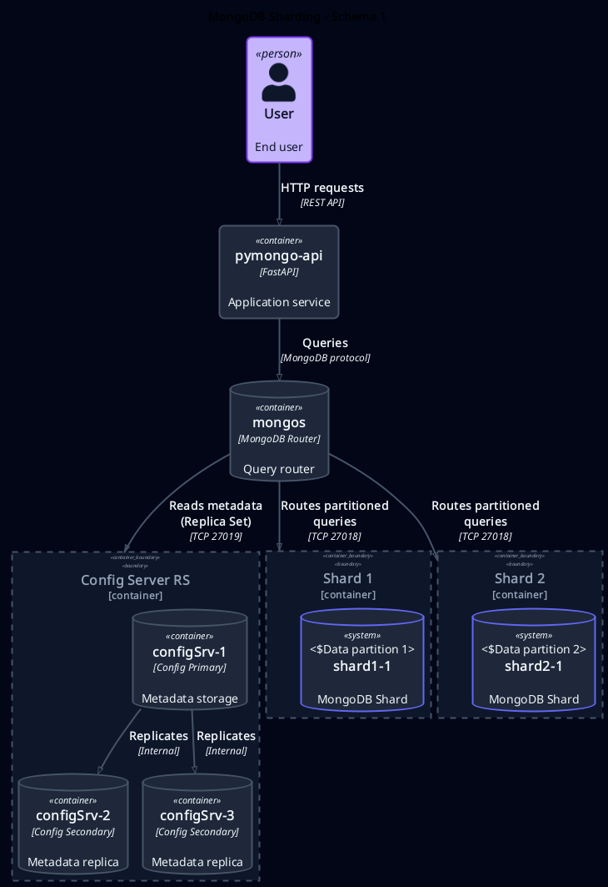
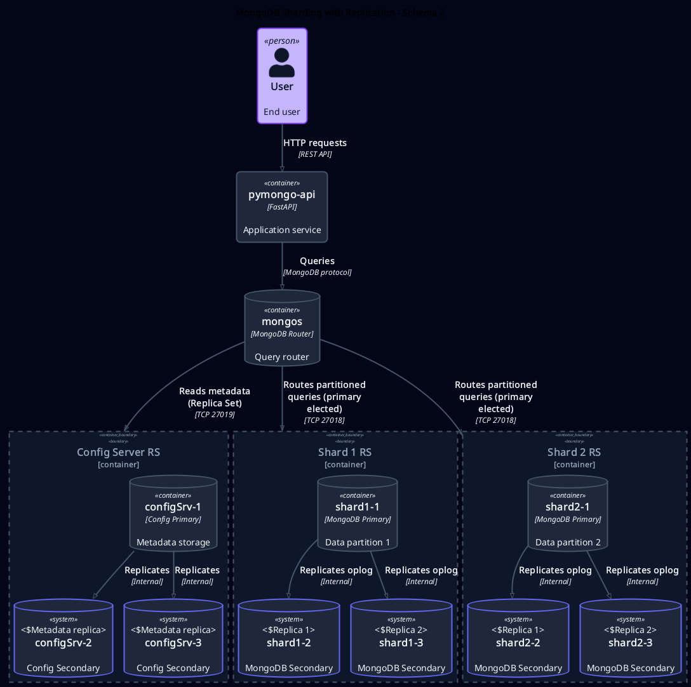
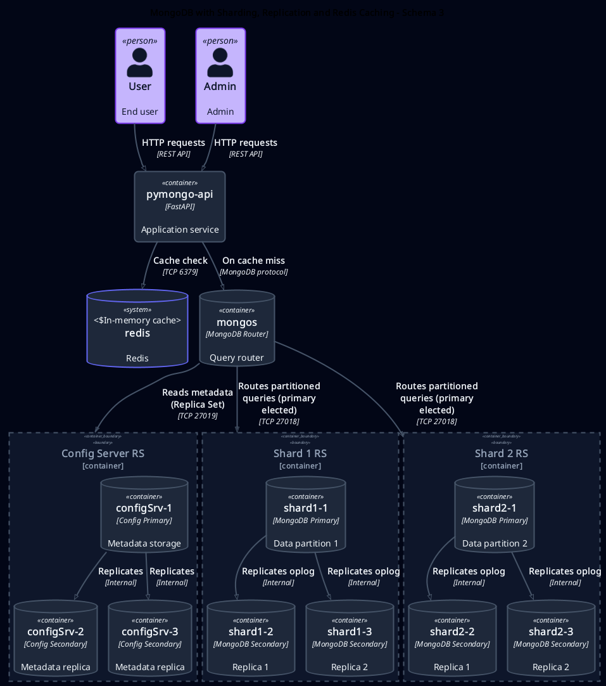
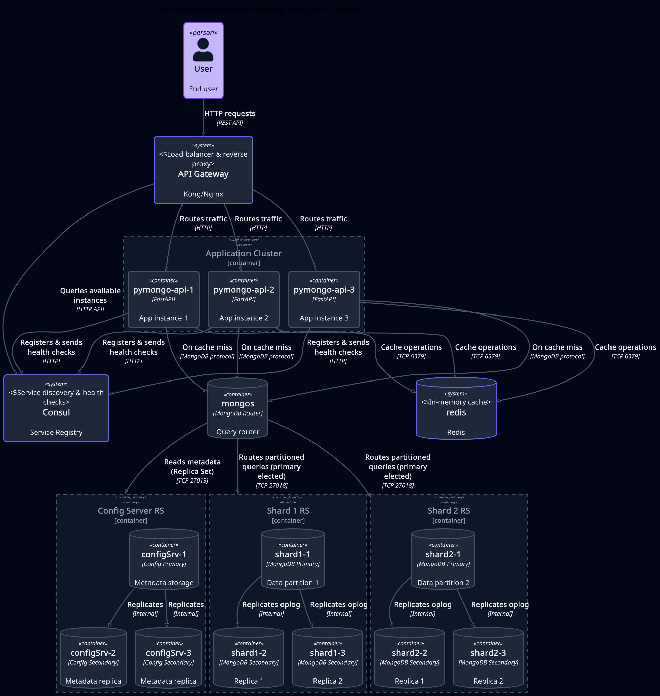
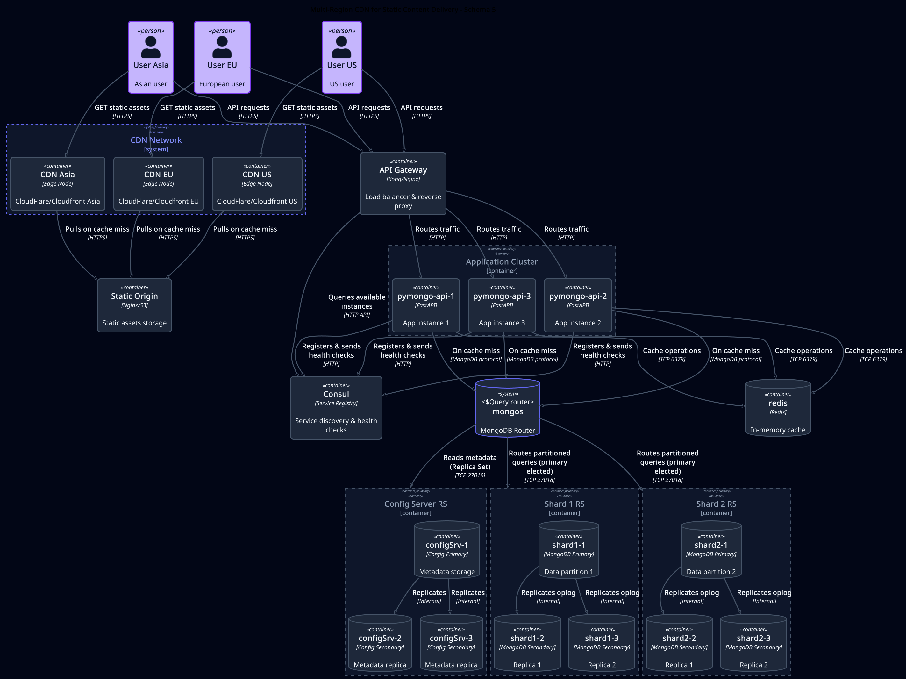

# Architecture Pro: Black Friday - Mobile World E-commerce

Проектная работа по архитектуре высоконагруженных систем для онлайн-магазина «Мобильный мир».

## Tech Stack


---

## Оглавление

**Часть I: Инфраструктура и диаграммы**
- [Быстрый старт](#быстрый-старт)
- [Структура проекта](#структура-проекта)
- [Tasks 1-6: Infrastructure & Diagrams](#tasks-1-6-infrastructure--diagrams)

**Часть II: Архитектурная документация**
- [Tasks 7-10: Architecture Documentation](#tasks-7-10-architecture-documentation)
- [Архитектурные решения](#архитектурные-решения)
- [Границы и SLO](#границы-и-slo)

---

## Структура проекта

```
.
├── mongo-sharding/          # Task 1: Basic sharding setup
├── mongo-sharding-repl/     # Task 2: Sharding + replication
├── sharding-repl-cache/     # Tasks 3-4: Final MongoDB setup with Redis
├── docs/
│   ├── diag/                # Architecture diagrams (Tasks 1, 5-6)
│   │   ├── 01-sharding.puml
│   │   ├── 02-replication.puml
│   │   ├── 03-caching.puml
│   │   ├── 04-api-gateway-consul.puml
│   │   └── 05-cdn.puml
│   ├── task-07-sharding.md              # Task 7: Collection schemas & shard keys
│   ├── task-08-hot-shards.md            # Task 8: Hot shard detection & mitigation
│   ├── task-09-read-prefs.md            # Task 9: Read preferences & consistency
│   └── task-10-cassandra-migration.md   # Task 10: Cassandra migration strategy
└── README.md
```

---

## Задания

### Tasks 1-6: Infrastructure & Diagrams

#### Task 1: Architecture Diagrams
Design architecture evolution from basic sharding to CDN-enabled infrastructure.

Diagrams created (PlantUML C4):
- [01-sharding.puml](docs/diag/01-sharding.puml) - Basic sharding
- [02-replication.puml](docs/diag/02-replication.puml) - Sharding + replication
- [03-caching.puml](docs/diag/03-caching.puml) - Replication + Redis cache
- [04-api-gateway-consul.puml](docs/diag/04-api-gateway-consul.puml) - Horizontal scaling
- [05-cdn.puml](docs/diag/05-cdn.puml) - Multi-region CDN

#### Task 2: MongoDB Sharding
**Location:** `mongo-sharding/` | [README](mongo-sharding/README.md)



Basic sharding: 2 shards (single node each) + config servers + mongos router.

**Quick start:**
```bash
cd mongo-sharding
make verify KEEP=1
```

#### Task 3: Sharding + Replication
**Location:** `mongo-sharding-repl/` | [README](mongo-sharding-repl/README.md)



Sharding with replica sets (3 replicas per shard) for high availability.

**Quick start:**
```bash
cd mongo-sharding-repl
make verify KEEP=1
```

#### Task 4: Redis Caching + Performance Testing
**Location:** `sharding-repl-cache/` | [README](sharding-repl-cache/README.md)



Complete solution: sharding + replication + Redis cache with automated validation.

**Quick start:**
```bash
cd sharding-repl-cache
make verify KEEP=1
```

Automated checks:
- Document distribution across shards
- Replica set health (3 replicas per shard)
- Redis cache effectiveness (<100ms on cache hit)
- API connectivity and shard topology

#### Task 5: Horizontal Scaling with API Gateway & Consul
[04-api-gateway-consul.puml](docs/diag/04-api-gateway-consul.puml)



- Multiple application instances for fault tolerance
- API Gateway (Kong/Nginx) for load balancing
- Consul for service discovery and health checks

#### Task 6: CDN for Multi-Region Delivery
**Diagram:** [05-cdn.puml](docs/diag/05-cdn.puml)
**Preview:** 

- CDN edge nodes in multiple regions (EU, US, Asia)
- Static content delivery optimization
- Reduced latency for global users

---

### Tasks 7-10: Architecture Documentation

#### Task 7: Collection Schema Design & Sharding Strategy
**Document:** [task-07-sharding.md](docs/task-07-sharding.md)

**Key decisions:**
- **Products:** `{category: 1, product_id: 1}` - compound key for catalog queries
- **Orders:** `{user_id: "hashed"}` - uniform distribution, targeted user queries
- **Carts:** `{session_id: "hashed"}` - unified key for guests and users

**Includes:**
- Collection schemas with field types
- Shard key selection with alternatives analysis
- Index strategies
- MongoDB commands
- SG (Scatter-Gather) metrics

#### Task 8: Hot Shard Detection & Mitigation
**Document:** [task-08-hot-shards.md](docs/task-08-hot-shards.md)

**Monitoring metrics:**
- Resource utilization (CPU, Memory, Disk I/O)
- QPS distribution across shards
- Chunk distribution and jumbo chunks
- Latency p95/p99

**Mitigation mechanisms:**
- Aggressive balancer configuration
- Manual chunk splitting and moving
- Zone sharding for popular categories
- Read scaling with secondaries
- Redis caching for hot products

**15-minute incident playbook included**

#### Task 9: Read Preferences & Consistency
**Document:** [task-09-read-prefs.md](docs/task-09-read-prefs.md)

**Read preference strategy:**
| Operation | Preference | Max Lag | Reasoning |
|-----------|------------|---------|-----------|
| Inventory check | `primary` | 0 ms | Prevent overselling |
| Active cart | `primary` | 0 ms | Read-your-writes |
| Product catalog | `secondary` | ≤10 min | Reduce primary load |
| Order history | `secondaryPreferred` | ≤2 sec | Balance load/freshness |

**Expected effect:** 40-48% offload from primary

#### Task 10: Cassandra Migration Strategy
**Document:** [task-10-cassandra-migration.md](docs/task-10-cassandra-migration.md)

**Migration scope:**
- ✅ Orders → Cassandra (write-heavy, append-mostly)
- ✅ Carts → Cassandra (TTL, high update frequency)
- ✅ Order Events → Cassandra (time-series audit log)
- ✅ User Sessions → Cassandra (TTL, local reads)
- ❌ Products inventory → MongoDB (ACID, serialization required)

**Key features:**
- Partition key design with time-bucketing
- Denormalization strategies (3 tables for orders)
- Consistency levels per operation
- LWT (Lightweight Transactions) for cart checkout
- Anti-entropy mechanisms (Hinted Handoff, Read Repair, scheduled repairs)

---

## Архитектурные решения

### Масштабируемость
- Horizontal scaling через sharding (4-8 shards)
- Replica sets (3 replicas per shard) для HA
- API Gateway + Consul для динамической балансировки
- CDN для статического контента

### Производительность
- Redis cache (TTL 300s) для горячих данных
- Read preferences для распределения нагрузки
- Compound shard keys для targeted queries
- Zone sharding для popular categories

### Надёжность
- Multi-DC replication (Cassandra)
- Tunable consistency levels
- Health checks через Consul
- Automated failover (replica sets)

### Monitoring
- Resource metrics (CPU, RAM, Disk I/O)
- QPS distribution per shard
- Replication lag tracking
- Latency SLO (p95/p99)

---

## Границы и SLO

**Operational scale:**
- Products: ≤10M documents
- Orders: ≤1M/day, 365-day retention
- Carts: ≤500K active
- Cluster: 4-8 shards, 3 replicas/shard

**Latency SLO (p95):**
- Product catalog (targeted): <15ms
- Order history (targeted): <12ms
- Active cart: <10ms

---

## Авторство

**Проект:** Яндекс Практикум - Architecture Pro

**Кейс:** Онлайн-магазин «Мобильный мир»

**Дата:** Октябрь 2025
