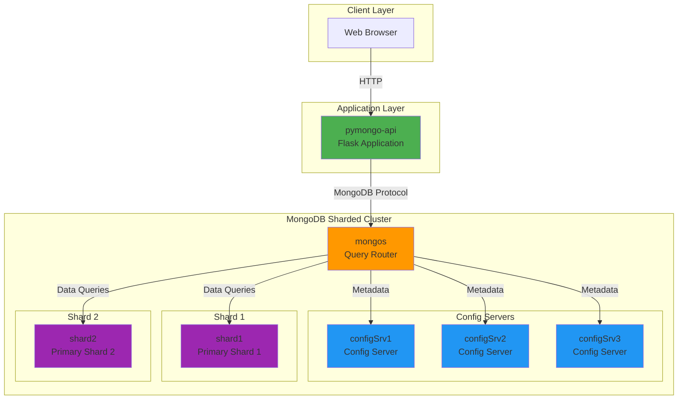
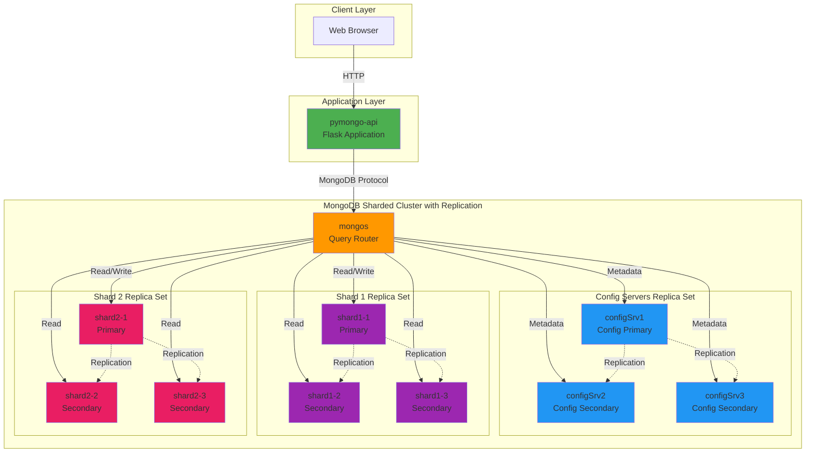
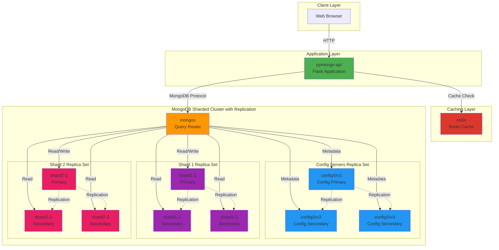
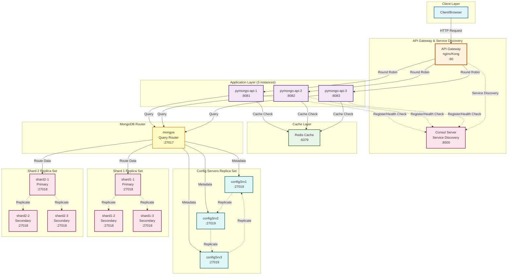

# Архитектура MongoDB Sharding Optimization

> 📊 Этот документ содержит визуализацию всех архитектурных схем с интерактивным рендерингом  
> 🏠 [← Вернуться к README](../README.md) | 📖 [Подробное планирование →](../PLANNING.md)

## Схема 1: Базовое шардирование

### Компоненты:
- **pymongo-api** - Flask приложение
- **mongos** - Query Router для маршрутизации запросов
- **configSrv1, configSrv2, configSrv3** - Config Servers для хранения метаданных кластера
- **shard1, shard2** - Шарды для хранения данных

### Сетевые взаимодействия:
- Client → API (HTTP)
- API → mongos (MongoDB Protocol)
- mongos → Config Servers (Metadata queries)
- mongos → Shards (Data queries)

---

## Схема 2: Шардирование + Репликация

### Компоненты:
- **Config Servers Replica Set**: configSrv1 (Primary), configSrv2, configSrv3 (Secondaries)
- **Shard 1 Replica Set**: shard1-1 (Primary), shard1-2, shard1-3 (Secondaries)
- **Shard 2 Replica Set**: shard2-1 (Primary), shard2-2, shard2-3 (Secondaries)

### Репликация:
- Пунктирные стрелки показывают репликацию данных от Primary к Secondary нодам
- Primary ноды обрабатывают запись (Write)
- Secondary ноды могут обрабатывать чтение (Read)
- При падении Primary автоматически выбирается новая из Secondary (Failover)

---

## Схема 3: Шардирование + Репликация + Кеширование

### Новый компонент:
- **redis** - Redis Cache для кеширования частых запросов

### Кеширование:
- Приложение сначала проверяет наличие данных в Redis
- При cache hit - данные возвращаются из Redis (быстрее)
- При cache miss - данные запрашиваются из MongoDB и сохраняются в Redis
- Снижение нагрузки на MongoDB и ускорение ответов

---

## Схема 4: Шардирование + Репликация + Кеширование + API Gateway & Service Discovery

### Новые компоненты:

**API Gateway (nginx/Kong):**
- Единая точка входа для клиентов
- Балансировка нагрузки между инстансами приложения (Round Robin)
- Порт 80 для HTTP трафика

**Consul Server:**
- Service Discovery - динамическое обнаружение сервисов
- Health Checks - мониторинг состояния инстансов приложения
- Автоматическое добавление/удаление инстансов из балансировки

**Множественные инстансы приложения (3 шт):**
- **pymongo-api-1** (порт 8081)
- **pymongo-api-2** (порт 8082)
- **pymongo-api-3** (порт 8083)

### Взаимодействия:

**Service Discovery:**
- Каждый инстанс приложения регистрируется в Consul при запуске
- Consul проводит health checks для определения доступности инстансов
- API Gateway получает список доступных инстансов из Consul
- При падении инстанса Consul автоматически исключает его из списка

**Load Balancing:**
- Клиент отправляет запрос на API Gateway (единая точка входа)
- API Gateway распределяет запросы между доступными инстансами (Round Robin)
- Если инстанс недоступен, запрос направляется на другой инстанс

**Horizontal Scaling:**
- Можно запустить любое количество инстансов приложения
- Новые инстансы автоматически регистрируются в Consul
- API Gateway автоматически начинает направлять на них трафик
- Нет необходимости в ручной настройке балансировки

### Преимущества:

1. **Нет simple point of failure для приложения**
   - При падении одного инстанса остальные продолжают работать
   - Обновления можно делать по одному инстансу (rolling updates)

2. **Горизонтальное масштабирование приложения**
   - Легко добавить новые инстансы при росте нагрузки
   - Можно масштабировать независимо от MongoDB

3. **Автоматическое обнаружение сервисов**
   - Не нужно вручную настраивать список инстансов
   - Динамическая балансировка при изменении количества инстансов

4. **Высокая доступность**
   - Zero-downtime deployments
   - Graceful degradation при проблемах

---

## Преимущества итоговой архитектуры

### 1. Горизонтальная масштабируемость (Sharding)
- Данные распределены между несколькими шардами
- Возможность добавления новых шардов при росте нагрузки
- Параллельная обработка запросов на разных шардах

### 2. Отказоустойчивость (Replication)
- Каждый компонент имеет реплики
- Автоматическое восстановление при отказе (Automatic Failover)
- Нулевое время простоя при падении одной ноды

### 3. Производительность (Caching)
- Redis кеширует частые запросы
- Снижение latency для популярных данных
- Уменьшение нагрузки на MongoDB

### 4. Готовность к "черной пятнице"
- Способность обрабатывать высокий трафик
- Отсутствие single point of failure
- Быстрые ответы даже при пиковой нагрузке

