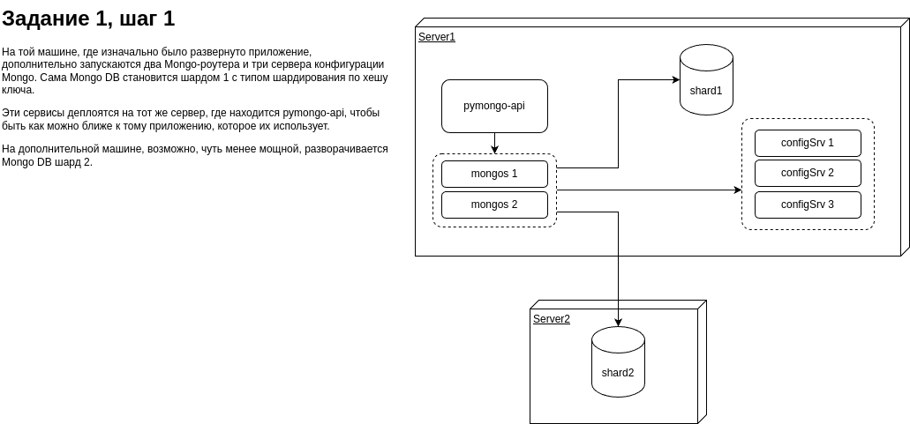

# MongoDB Sharding

## Архитектура решения

Архитектура решения представлена на следующей схеме

## Запуск решения

Запуск всех сервисов

    $ docker compose up

Конфигурирование кластера

    $ ./init-cluster.sh

Наполнение кластера данными

    $ mongo-init.sh

## Проверка шардирования

    $ docker exec -it shard1 mongosh
    test> use somedb
    somedb> db.helloDoc.countDocuments()

В результате подсчета документов на шарде 1 должны быть документы, их количество -- примерно 500. Но не 0 и не 1000. Остальные документы -- на шарде 2, проверить их можно тем же способом.

## Проверка API

    $ curl -X 'GET' 'http://localhost:8080/helloDoc/count' -H 'accept: application/json'

Ответ должен показать 1000.
