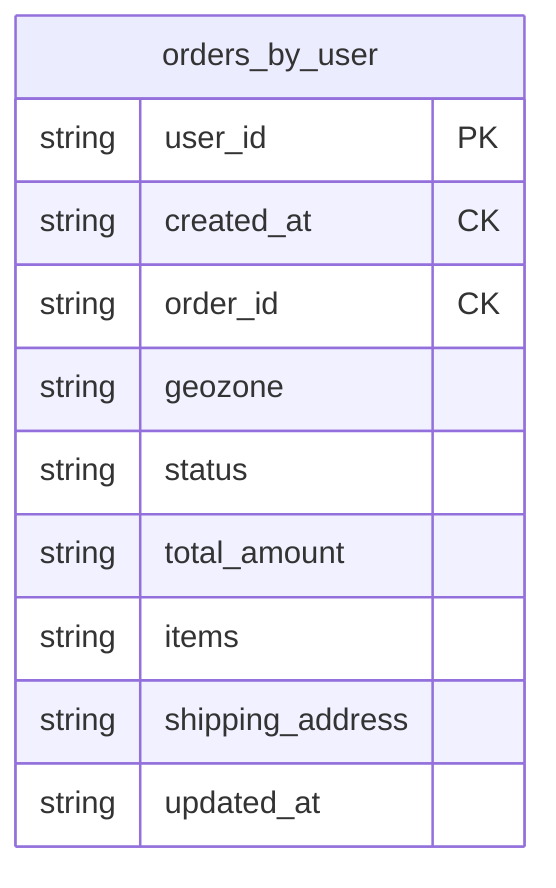
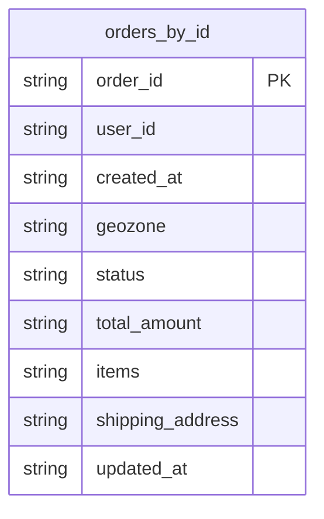
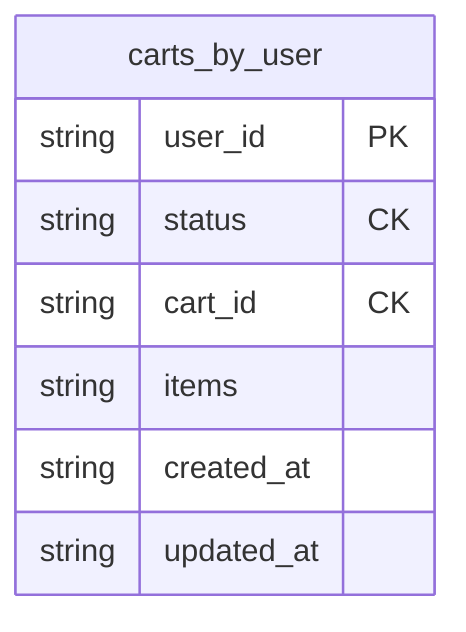
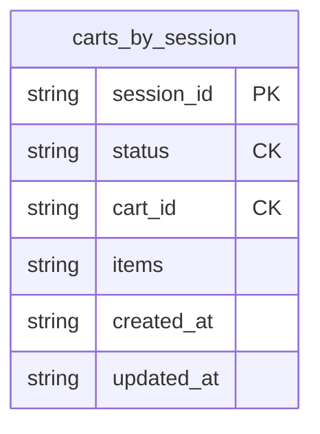

# Задание 10. Миграция на Cassandra: модель данных, стратегии репликации и шардирования

## Введение

Во время «чёрной пятницы» интернет-магазин "Мобильный мир" столкнулся с проблемами масштабирования MongoDB при нагрузке 50 000 запросов/сек. Основная проблема - полное перераспределение данных при добавлении новых шардов, что вызывало просадку latency в пик нагрузки.

**Цели миграции на Cassandra:**
1. Высокая отказоустойчивость (leaderless-репликация)
2. Быстрое горизонтальное масштабирование без полного перераспределения данных
3. Равномерное распределение данных

---

## Задание 10.1. Анализ критически важных данных

### Анализ сущностей интернет-магазина

В сервисе используются три основные коллекции:
1. **products** - каталог товаров с остатками по геозонам
2. **orders** - заказы клиентов
3. **carts** - корзины пользователей и гостей

### Критерии выбора данных для Cassandra

| Критерий | products | orders | carts |
|----------|----------|--------|-------|
| **Скорость записи** | Высокая (обновление остатков) | Очень высокая (создание заказов) | Высокая (операции с корзиной) |
| **Скорость чтения** | Очень высокая (каталог) | Высокая (история заказов) | Высокая (получение корзины) |
| **Требования к целостности** | Критичная (остатки товаров) | Критичная (финансовые данные) | Средняя (можно пересоздать) |
| **Объём данных** | Средний (тысячи товаров) | Очень большой (миллионы заказов) | Большой (активные сессии) |
| **Геораспределённость** | Да (остатки по геозонам) | Да (заказы по регионам) | Нет |
| **Паттерн доступа** | Read-heavy | Write-heavy в пики | Read/Write balanced |

### Решение: какие данные переносить в Cassandra

####  **orders** - ИДЕАЛЬНО для Cassandra

**Обоснование:**
1. **Write-heavy нагрузка в пики** - во время "чёрной пятницы" создаётся огромное количество заказов
2. **Временные данные** - заказы имеют временную метку, что идеально для time-series паттерна Cassandra
3. **Append-only операции** - заказы создаются и редко изменяются (только статус)
4. **Масштабируемость** - объём данных растёт линейно со временем
5. **Геораспределённость** - заказы можно распределить по датацентрам близко к пользователям
6. **Leaderless репликация** - критично для финансовых данных, нет single point of failure

**Паттерны запросов:**
- Создание заказа (INSERT) - очень частая операция
- Получение истории заказов пользователя (SELECT по user_id)
- Получение заказа по order_id (SELECT по PK)
- Обновление статуса заказа (UPDATE) - редкая операция

####  **carts** - ХОРОШО подходит для Cassandra

**Обоснование:**
1. **Высокая частота операций** - добавление/удаление товаров, создание корзин
2. **Временные данные** - корзины имеют TTL, автоматически удаляются
3. **Session-based** - каждая сессия независима, нет сложных транзакций
4. **Масштабируемость** - количество активных корзин пропорционально онлайн-пользователям
5. **Низкие требования к целостности** - корзину можно пересоздать, не критично

**Паттерны запросов:**
- Создание корзины (INSERT)
- Получение активной корзины (SELECT по user_id/session_id)
- Обновление корзины (UPDATE items)
- Слияние корзин при логине (SELECT + UPDATE + DELETE)

####  **products** - НЕ рекомендуется для Cassandra

**Обоснование:**
1. **Требуется строгая целостность остатков** - критично для бизнеса, нельзя продать больше товара, чем есть
2. **Сложные атомарные операции** - проверка остатка и списание должны быть атомарными
3. **Относительно небольшой объём данных** - тысячи товаров, не требует экстремального масштабирования
4. **Сложные запросы** - поиск по категориям, фильтрация по цене, полнотекстовый поиск
5. **Частые обновления одних и тех же записей** - может привести к "горячим" партициям в Cassandra

**Альтернатива:** Оставить в MongoDB или использовать PostgreSQL с ACID-гарантиями для критичных операций с остатками.

## Задание 10.2. Модель данных Cassandra

### 1. Таблица `orders_by_user`

**Назначение:** Получение истории заказов конкретного пользователя (основной use case)

**Структура таблицы:**



**Обоснование выбора ключей:**

1. **Partition Key: `user_id`**
   -  Высокая кардинальность (миллионы пользователей)
   -  Равномерное распределение данных (каждый пользователь - отдельная партиция)
   -  Оптимизация основного запроса: "получить все заказы пользователя"
   -  Избегаем "горячих" партиций - заказы распределены по всем пользователям

2. **Clustering Key: `created_at DESC, order_id ASC`**
   -  Сортировка заказов по времени (новые первыми)
   -  `order_id` обеспечивает уникальность при одинаковом timestamp
   -  Эффективные range-запросы: "заказы за последний месяц"
   -  Естественная пагинация по времени

**Примеры запросов:**

```cql
-- Получить последние 10 заказов пользователя
SELECT * FROM orders_by_user
WHERE user_id = 'USER-98765'
LIMIT 10;

-- Получить заказы за последний месяц
SELECT * FROM orders_by_user
WHERE user_id = 'USER-98765'
  AND created_at >= '2024-10-27T00:00:00Z';

-- Получить конкретный заказ
SELECT * FROM orders_by_user
WHERE user_id = 'USER-98765'
  AND created_at = '2024-11-27T12:30:00Z'
  AND order_id = 'ORD-2024-123456';
```

---

### 2. Таблица `orders_by_id`

**Назначение:** Быстрый доступ к заказу по order_id (для отслеживания статуса)

**Структура таблицы:**



**Обоснование выбора ключей:**

1. **Partition Key: `order_id`**
   -  Уникальный идентификатор заказа
   -  Равномерное распределение (UUID или последовательный ID с префиксом)
   -  Прямой доступ O(1) по order_id
   -  Нет "горячих" партиций

**Примеры запросов:**

```cql
-- Получить заказ по ID (для отслеживания)
SELECT * FROM orders_by_id
WHERE order_id = 'ORD-2024-123456';

-- Обновить статус заказа
UPDATE orders_by_id
SET status = 'shipped', updated_at = toTimestamp(now())
WHERE order_id = 'ORD-2024-123456';
```

---

### 3. Таблица `carts_by_user`

**Назначение:** Корзины зарегистрированных пользователей

**Структура таблицы:**



**Обоснование выбора ключей:**

1. **Partition Key: `user_id`**
   -  Высокая кардинальность
   -  Все корзины пользователя в одной партиции (эффективно)
   -  Оптимизация запроса: "получить активную корзину пользователя"

2. **Clustering Key: `status ASC, cart_id DESC`**
   -  Сортировка по статусу (active, ordered, abandoned)
   -  `cart_id` (timeuuid) обеспечивает уникальность и временную сортировку
   -  Быстрый доступ к активной корзине: `WHERE user_id = ? AND status = 'active'`

**Примеры запросов:**

```cql
-- Получить активную корзину пользователя
SELECT * FROM carts_by_user
WHERE user_id = 'USER-98765'
  AND status = 'active'
LIMIT 1;

-- Добавить товар в корзину
UPDATE carts_by_user
SET items = items + [{product_id: 'PROD-12345', quantity: 1, added_at: toTimestamp(now())}],
    updated_at = toTimestamp(now())
WHERE user_id = 'USER-98765'
  AND status = 'active'
  AND cart_id = 12345678-1234-1234-1234-123456789abc;

-- Отметить корзину как заказанную
UPDATE carts_by_user
SET status = 'ordered'
WHERE user_id = 'USER-98765'
  AND status = 'active'
  AND cart_id = 12345678-1234-1234-1234-123456789abc;
```

---

### 5. Таблица `carts_by_session`

**Назначение:** Корзины гостевых пользователей

**Структура таблицы:**



**Обоснование:**
- Аналогично `carts_by_user`, но для гостей
- Отдельная таблица для избежания NULL-значений в partition key
- TTL 7 дней для автоматической очистки

**Слияние корзин при логине:**

```cql
-- 1. Получить гостевую корзину
SELECT * FROM carts_by_session
WHERE session_id = 'SESS-abc123'
  AND status = 'active';

-- 2. Получить пользовательскую корзину
SELECT * FROM carts_by_user
WHERE user_id = 'USER-98765'
  AND status = 'active';

-- 3. Объединить items на стороне приложения

-- 4. Обновить пользовательскую корзину
UPDATE carts_by_user
SET items = [merged_items],
    updated_at = toTimestamp(now())
WHERE user_id = 'USER-98765'
  AND status = 'active'
  AND cart_id = ?;

-- 5. Отметить гостевую как abandoned
UPDATE carts_by_session
SET status = 'abandoned'
WHERE session_id = 'SESS-abc123'
  AND status = 'active'
  AND cart_id = ?;
```

## Преимущества при решардинге

**Cassandra vs MongoDB:**

| Аспект | MongoDB Range Sharding | Cassandra Consistent Hashing |
|--------|------------------------|------------------------------|
| **Добавление узла** | Полное перераспределение данных | Перемещается только 1/N данных |
| **Время решардинга** | Часы/дни | Минуты |
| **Влияние на latency** | Сильное (вся система) | Минимальное (локальное) |
| **Downtime** | Возможен | Нет (online resharding) |

**Пример:** При добавлении 4-го узла в кластер из 3 узлов:
- MongoDB: перераспределяет 100% данных между 4 узлами
- Cassandra: перемещает только ~25% данных (1/4) на новый узел

---

## Задание 10.3. Стратегии обеспечения целостности данных

### Обзор стратегий Cassandra

1. **Hinted Handoff** - временное хранение записей для недоступных узлов
2. **Read Repair** - исправление несогласованности при чтении
3. **Anti-Entropy Repair** - фоновая синхронизация данных между репликами

### Выбор стратегий для каждой сущности

---

### 1. Таблица `orders_by_user` и `orders_by_id`

**Требования:**
-  Критичная целостность (финансовые данные)
-  Высокая доступность
-  Допустима небольшая задержка (eventual consistency)

**Выбранные стратегии:**

#### Consistency Level: QUORUM

```cql
-- Запись заказа
INSERT INTO orders_by_user (...)
USING CONSISTENCY QUORUM;

-- Чтение заказа
SELECT * FROM orders_by_user
WHERE user_id = 'USER-98765'
USING CONSISTENCY QUORUM;
```

**Обоснование:**
- QUORUM (N/2 + 1) обеспечивает strong consistency
- При RF=3: нужно 2 из 3 узлов для успешной операции
- Баланс между consistency и availability

#### Hinted Handoff: ENABLED

```yaml
# cassandra.yaml
hinted_handoff_enabled: true
max_hint_window_in_ms: 10800000  # 3 часа
```

**Обоснование:**
-  Критично для заказов - нельзя потерять данные
-  Если узел недоступен, hints сохраняются на других узлах
-  При восстановлении узла данные автоматически синхронизируются
-  Окно 3 часа - компромисс между надёжностью и нагрузкой

#### Read Repair: ENABLED (10% вероятность)

```cql
-- Настройка таблицы
ALTER TABLE orders_by_user
WITH read_repair_chance = 0.1
  AND dclocal_read_repair_chance = 0.1;
```

**Обоснование:**
-  Пассивное исправление несогласованности при чтении
-  10% - баланс между consistency и latency
-  Не влияет на критичные операции записи
-  Добавляет небольшую задержку к 10% запросов чтения

#### Anti-Entropy Repair: Еженедельно

```bash
# Cron job для полного repair
0 2 * * 0 nodetool repair -pr orders_by_user
0 3 * * 0 nodetool repair -pr orders_by_id
```

**Обоснование:**
-  Гарантирует eventual consistency для всех данных
-  Еженедельно - достаточно для финансовых данных
-  Ночью в воскресенье - минимальная нагрузка
-  Ресурсоёмкая операция, но необходима для критичных данных

---

### 2. Таблицы `carts_by_user` и `carts_by_session`

**Требования:**
-  Средняя критичность (можно пересоздать)
-  Высокая скорость операций
-  Низкая latency важнее consistency

**Выбранные стратегии:**

#### Consistency Level: ONE (для записи) / LOCAL_QUORUM (для чтения)

```cql
-- Быстрая запись в корзину
UPDATE carts_by_user
SET items = items + [...]
USING CONSISTENCY ONE;

-- Чтение корзины с гарантией
SELECT * FROM carts_by_user
WHERE user_id = 'USER-98765'
USING CONSISTENCY LOCAL_QUORUM;
```

**Обоснование:**
- ONE для записи - минимальная latency
- LOCAL_QUORUM для чтения - баланс между скоростью и consistency
- Если корзина потеряна - пользователь может пересоздать

#### Hinted Handoff: ENABLED

```yaml
hinted_handoff_enabled: true
max_hint_window_in_ms: 3600000  # 1 час (меньше, чем для orders)
```

**Обоснование:**
-  Включено для базовой надёжности
-  Окно 1 час - корзины менее критичны, чем заказы
-  Снижает нагрузку на систему

#### Read Repair: DISABLED

```cql
ALTER TABLE carts_by_user
WITH read_repair_chance = 0.0
  AND dclocal_read_repair_chance = 0.0;
```

**Обоснование:**
-  Минимизация latency для операций с корзиной
-  Корзины имеют TTL 7 дней - несогласованность временная
-  Eventual consistency достаточна для корзин

#### Anti-Entropy Repair: Ежемесячно

```bash
# Cron job для repair (реже, чем для orders)
0 3 1 * * nodetool repair -pr carts_by_user
0 4 1 * * nodetool repair -pr carts_by_session
```

**Обоснование:**
-  Ежемесячно достаточно для некритичных данных
-  Снижает нагрузку на кластер
-  TTL автоматически очищает старые данные


## Компромиссы между latency и consistency

### 1. Orders (QUORUM)

**Преимущества:**
-  Strong consistency для финансовых данных
-  Гарантия целостности заказов
-  Защита от потери данных

**Недостатки:**
-  Выше latency (ожидание 2 из 3 узлов)
-  Снижение throughput при высокой нагрузке

**Метрики:**
- Latency: ~10-20ms (вместо 5ms при ONE)
- Availability: 99.9% (при RF=3 выдерживает отказ 1 узла)

### 2. Carts (ONE/LOCAL_QUORUM)

**Преимущества:**
-  Минимальная latency для записи
-  Высокий throughput
-  Лучший user experience

**Недостатки:**
-  Eventual consistency
-  Возможна временная несогласованность

**Метрики:**
- Latency записи: ~5ms
- Latency чтения: ~10ms
- Availability: 99.99%

## Мониторинг и алертинг

### Ключевые метрики для мониторинга

```yaml
# Prometheus metrics
cassandra_hints_pending: > 1000  # Алерт: проблемы с узлом
cassandra_read_latency_p99: > 50ms  # Алерт: деградация производительности
cassandra_write_latency_p99: > 30ms
cassandra_repair_time: > 4h  # Алерт: долгий repair
```

### Grafana дашборды

1. **Orders Dashboard:**
   - Write latency (p50, p95, p99)
   - Read latency
   - Throughput (ops/sec)
   - Consistency level distribution

2. **Carts Dashboard:**
   - Active carts count
   - TTL expiration rate
   - Session merge operations

3. **Cluster Health:**
   - Node availability
   - Hints pending
   - Repair status
   - Disk usage per node

---

## Заключение

### Итоговая архитектура

```
┌─────────────────────────────────────────────────────────┐
│                     Load Balancer                       │
└─────────────────────────────────────────────────────────┘
                              │
                              ▼
┌────────────────────────────────────────────────────────┐
│                   Application Layer                    │
│  ┌──────────────┐  ┌──────────────┐  ┌──────────────┐  │
│  │   Orders     │  │    Carts     │  │   Products   │  │
│  │   Service    │  │   Service    │  │   Service    │  │
│  └──────────────┘  └──────────────┘  └──────────────┘  │
└────────────────────────────────────────────────────────┘
         │                    │                    │
         ▼                    ▼                    ▼
┌──────────────────┐  ┌───────────────────┐  ┌──────────────┐
│   Cassandra      │  │   Cassandra       │  │   MongoDB    │
│   Cluster        │  │   Cluster         │  │   Cluster    │
│                  │  │                   │  │              │
│ • orders_by_user │  │ • carts_by_user   │  │ • products   │
│ • orders_by_id   │  │ • carts_by_session│  │              │
│                  │  │                   │  │              │
│ RF=3, QUORUM     │  │ RF=3, ONE/LQ      │  │ Sharded      │
└──────────────────┘  └───────────────────┘  └──────────────┘
```

### Рекомендации по внедрению

**Фаза 1: Подготовка**
1. Развернуть тестовый кластер Cassandra (3 узла)
2. Настроить мониторинг (Prometheus + Grafana)
3. Провести нагрузочное тестирование
4. Обучить команду работе с CQL

**Фаза 2: Миграция orders**
1. Создать таблицы `orders_by_user` и `orders_by_id`
2. Настроить dual-write (MongoDB + Cassandra)
3. Мигрировать исторические данные (batch процесс)
4. Переключить чтение на Cassandra
5. Отключить запись в MongoDB

**Фаза 3: Миграция carts**
1. Создать таблицы `carts_by_user` и `carts_by_session`
2. Настроить dual-write
3. Переключить на Cassandra
4. Мониторинг и оптимизация

**Фаза 4: Оптимизация**
1. Настройка compaction strategies
2. Оптимизация consistency levels
3. Tuning JVM и OS параметров
4. Capacity planning
