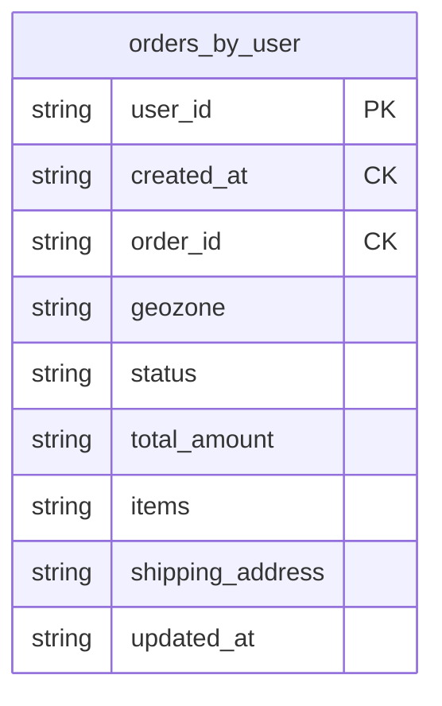
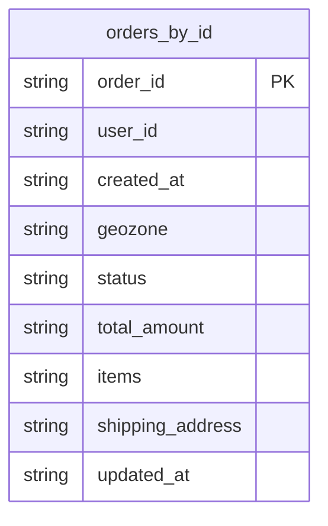
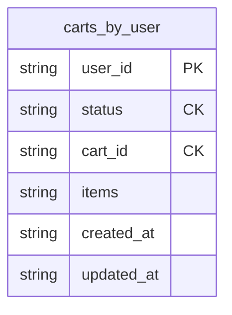
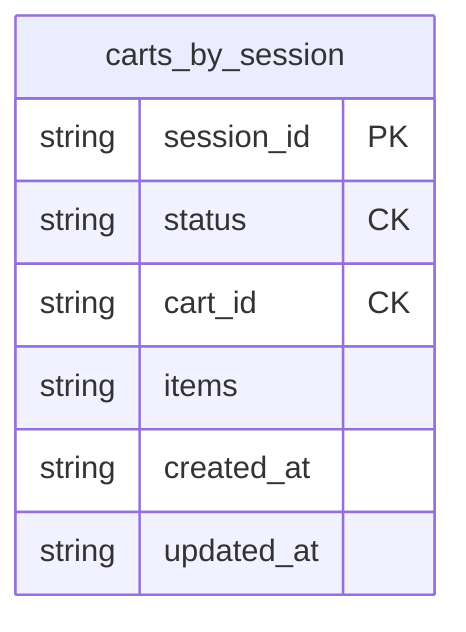

# Задание 7. Проектирование схем коллекций для шардирования данных

## Анализ требований

Интернет-магазин "Мобильный мир" работает с тремя основными коллекциями:
- **products** - каталог товаров с остатками по геозонам
- **orders** - заказы клиентов с привязкой к геозонам
- **carts** - корзины пользователей и гостей

Ключевые факторы для выбора стратегии шардирования:
1. Наличие геозон в данных (orders и products содержат информацию о геозонах)
2. Высокая частота операций записи (создание заказов, обновление остатков)
3. Необходимость быстрого доступа к данным конкретного пользователя

## 1. Коллекция `products`

### Схема коллекции

```javascript
{
  _id: ObjectId("..."),
  product_id: "PROD-12345",           // Уникальный идентификатор товара
  name: "Смартфон X",                 // Наименование
  category: "Электроника",            // Категория товара
  price: 45990.00,                    // Цена
  stock_by_zone: {                    // Остатки по геозонам
    "moscow": 120,
    "ekaterinburg": 50,
    "kaliningrad": 30,
    "novosibirsk": 75
  },
  attributes: {                       // Дополнительные атрибуты
    color: "Черный",
    size: "6.5 дюймов",
    memory: "128GB"
  },
  created_at: ISODate("2024-01-15T10:00:00Z"),
  updated_at: ISODate("2024-11-20T14:30:00Z")
}
```

### Выбор шард-ключа: `{ category: 1, _id: 1 }`

**Обоснование:**

1. **Оптимизация основной операции - поиск по категориям**
   - Согласно требованиям: "Поиск товаров по категориям и фильтрация по диапазону цен"
   - Запросы направляются на конкретный шард
   - Эффективные range-запросы в рамках категории

2. **Равномерное распределение данных**
   - Категории товаров обеспечивают естественное разделение данных
   - Добавление `_id` гарантирует уникальность и высокую кардинальность
   - Предотвращает "горячие" шарды

3. **Поддержка частых обновлений остатков**
   - MongoDB поддерживает атомарные операции обновления вложенных полей
   - Использование операторов `$inc` для изменения остатков конкретной геозоны
   - Обновление `stock_by_zone.moscow` не блокирует обновление `stock_by_zone.ekaterinburg`

### Индексы

```javascript
// Шард-ключ (создается автоматически)
db.products.createIndex({ category: 1, _id: 1 })

// Для поиска по категории и цене
db.products.createIndex({ category: 1, price: 1 })

// Для быстрого доступа по product_id
db.products.createIndex({ product_id: 1 }, { unique: true })
```

### Примеры операций с остатками

**Проверка наличия товара в геозоне:**

```javascript
db.products.findOne({
  product_id: "PROD-12345",
  "stock_by_zone.moscow": { $gt: 0 }
})
```

**Атомарное обновление остатка в конкретной геозоне:**

```javascript
// Списание товара при покупке в Москве
db.products.updateOne(
  {
    product_id: "PROD-12345",
    "stock_by_zone.moscow": { $gte: 1 }  // Проверка наличия
  },
  {
    $inc: { "stock_by_zone.moscow": -1 },
    $set: { updated_at: new Date() }
  }
)
```

**Пополнение остатков:**

```javascript
db.products.updateOne(
  { product_id: "PROD-12345" },
  {
    $inc: { "stock_by_zone.ekaterinburg": 50 },
    $set: { updated_at: new Date() }
  }
)
```


## 2. Коллекция `orders`

### Схема коллекции

```javascript
{
  _id: ObjectId("..."),
  order_id: "ORD-2024-123456",        // Уникальный идентификатор заказа
  user_id: "USER-98765",              // Идентификатор клиента
  geozone: "moscow",                  // Геозона заказа
  created_at: ISODate("2024-11-27T12:30:00Z"),
  items: [                            // Список товаров
    {
      product_id: "PROD-12345",
      name: "Смартфон X",
      category: "Электроника",
      quantity: 1,
      price: 45990.00
    },
    {
      product_id: "PROD-67890",
      name: "Книга 'MongoDB для профессионалов'",
      category: "Книги",
      quantity: 2,
      price: 1200.00
    }
  ],
  status: "processing",               // new, processing, shipped, delivered, cancelled
  total_amount: 48390.00,             // Общая сумма заказа
  shipping_address: {
    city: "Москва",
    street: "Тверская ул., д. 10",
    postal_code: "125009"
  },
  updated_at: ISODate("2024-11-27T12:35:00Z")
}
```

### Выбор шард-ключа: `{ user_id: 1, created_at: 1 }`

**Обоснование:**

1. **Оптимизация основной операции - поиск истории заказов пользователя**
   - Согласно требованиям, одна из основных операций: "Поиск истории заказов конкретного пользователя"
   - Запросы типа `{ user_id: "USER-98765" }` с сортировкой по дате будут направлены на один шард
   - Все заказы одного пользователя хранятся последовательно, что оптимизирует range-запросы

2. **Высокая кардинальность**
   - Комбинация `user_id` и `created_at` обеспечивает очень высокую кардинальность
   - Каждый заказ имеет уникальную временную метку
   - Равномерное распределение данных по шардам

3. **Поддержка операций создания заказов**
   - Быстрое создание заказов: новые заказы автоматически распределяются по шардам
   - Монотонно возрастающий `created_at` обеспечивает последовательную запись

4. **Эффективное отображение статуса заказа**
   - При наличии `user_id` и примерной даты заказа, запрос направляется на конкретный шард
   - Индекс по `order_id` обеспечивает быстрый доступ к конкретному заказу

**Альтернативные варианты:**

- **`{ user_id: "hashed" }`** - обеспечит равномерное распределение, но потеряется эффективность range-запросов по истории заказов пользователя
- **`{ geozone: 1, user_id: 1 }`** - может быть полезен, если есть требования к географической локальности данных, но в задании такие требования не указаны
- **`{ _id: "hashed" }`** - равномерное распределение, но потребует broadcast-запросов для поиска заказов пользователя

### Индексы

```javascript
// Шард-ключ (создается автоматически)
db.orders.createIndex({ user_id: 1, created_at: 1 })

// Для быстрого доступа по order_id
db.orders.createIndex({ order_id: 1 }, { unique: true })

// Для фильтрации по статусу заказов пользователя
db.orders.createIndex({ user_id: 1, status: 1, created_at: -1 })

// Для аналитики по геозонам (если потребуется)
db.orders.createIndex({ geozone: 1, created_at: -1 })
```


## 3. Коллекция `carts`

### Схема коллекции

```javascript
{
  _id: ObjectId("..."),
  user_id: "USER-98765",              // Идентификатор пользователя (null для гостей)
  session_id: "SESS-abc123def456",    // Идентификатор сессии (для гостей)
  items: [                            // Список товаров в корзине
    {
      product_id: "PROD-12345",
      quantity: 1,
      added_at: ISODate("2024-11-27T10:15:00Z")
    },
    {
      product_id: "PROD-67890",
      quantity: 2,
      added_at: ISODate("2024-11-27T10:20:00Z")
    }
  ],
  status: "active",                   // active, ordered, abandoned
  created_at: ISODate("2024-11-27T10:15:00Z"),
  updated_at: ISODate("2024-11-27T10:20:00Z"),
  expires_at: ISODate("2024-12-04T10:15:00Z")  // TTL для автоматической очистки (7 дней)
}
```

### Выбор шард-ключа: `{ user_id: 1, session_id: 1 }`

**Обоснование:**

1. **Поддержка гостевых и пользовательских корзин**
   - Для зарегистрированных пользователей: `user_id` заполнен, `session_id` может быть null
   - Для гостей: `user_id` = null, `session_id` заполнен
   - Комбинация обеспечивает уникальность и эффективный поиск

2. **Оптимизация основных операций**
   - Получение активной корзины: `{ user_id: "USER-98765", status: "active" }` или `{ session_id: "SESS-...", status: "active" }`
   - Добавление/удаление товаров направляется на один шард
   - Слияние корзин при логине эффективно

3. **Равномерное распределение**
   - Высокая кардинальность благодаря уникальным user_id и session_id
   - Предотвращает "горячие" шарды

4. **Масштабируемость**
   - Поддержка большого количества одновременных сессий
   - Эффективная работа с TTL-индексом для автоматической очистки

**Почему не `{ _id: "hashed" }`:**
- Потребует broadcast-запросов для поиска корзины по user_id или session_id
- Неэффективен для основных операций

**Почему не `{ status: 1, user_id: 1 }`:**
- Status имеет низкую кардинальность (3 значения)
- Создаст неравномерное распределение данных

### Индексы

```javascript
// Шард-ключ (создается автоматически)
db.carts.createIndex({ user_id: 1, session_id: 1 })

// Для поиска активной корзины пользователя
db.carts.createIndex({ user_id: 1, status: 1 })

// Для поиска активной корзины гостя
db.carts.createIndex({ session_id: 1, status: 1 })

// TTL индекс для автоматической очистки старых корзин
db.carts.createIndex({ expires_at: 1 }, { expireAfterSeconds: 0 })

// Для поиска заброшенных корзин
db.carts.createIndex({ status: 1, updated_at: 1 })
```


## Сравнительная таблица стратегий шардирования

| Коллекция | Шард-ключ | Стратегия | Преимущества | Недостатки |
|-----------|-----------|-----------|--------------|------------|
| **products** | `{ category: 1, _id: 1 }` | Range-based | - Эффективные range-запросы по категориям<br>- Естественная группировка товаров<br>- Хорошая кардинальность | - Возможна неравномерность при популярных категориях |
| **orders** | `{ user_id: 1, created_at: 1 }` | Range-based | - Оптимизация основной операции (история заказов пользователя)<br>- Очень высокая кардинальность<br>- Последовательное хранение заказов пользователя | - Монотонно возрастающий ключ может создавать "горячий" шард при массовых заказах |
| **carts** | `{ user_id: 1, session_id: 1 }` | Range-based | - Поддержка гостей и пользователей<br>- Высокая кардинальность<br>- Эффективное слияние корзин | - Broadcast при поиске только по статусу |


## Заключение

Предложенная архитектура шардирования обеспечивает:

1. **Равномерное распределение данных** по шардам с учетом специфики каждой коллекции

2. **Оптимизацию основных операций** за счет правильного выбора шард-ключей:
   - Поиск товаров по категориям для `products`
   - Поиск истории заказов пользователя для `orders`
   - Быстрый доступ к корзинам для `carts`

3. **Высокую кардинальность** шард-ключей, предотвращающую "горячие" шарды

4. **Масштабируемость** при росте каталога, количества пользователей и заказов

5. **Поддержку всех основных операций** из требований задания

---

# Задание 8. Выявление и устранение «горячих» шардов

## Проблема

В коллекции [`products`] с шард-ключом `{ category: 1, _id: 1 }` возникла перегрузка одного из шардов из-за категории "Электроника", на которую приходится 70% запросов. Это классический пример "горячего" шарда, когда неравномерное распределение нагрузки приводит к деградации производительности.

## 1. Метрики мониторинга шардов

### 1.1. Базовые метрики распределения данных

#### Размер данных по шардам

```javascript
// Получение статистики по всем шардам
db.adminCommand({ listShards: 1 })

// Детальная статистика по коллекции products
db.products.getShardDistribution()

// Пример вывода:
// Shard shard01 at shard01/mongo-shard01:27017
//   data : 15GiB docs : 500000 chunks : 120
//   estimated data per chunk : 128MiB
//   estimated docs per chunk : 4166
//
// Shard shard02 at shard02/mongo-shard02:27017
//   data : 5GiB docs : 150000 chunks : 40
//   estimated data per chunk : 128MiB
//   estimated docs per chunk : 3750
```

**Критические пороги:**
- Разница в размере данных между шардами > 30% → требуется балансировка
- Разница в количестве документов > 40% → неравномерное распределение

#### Распределение чанков

```javascript
// Анализ распределения чанков по шардам
use config
db.chunks.aggregate([
  { $match: { ns: "shop.products" } },
  { $group: {
      _id: "$shard",
      count: { $sum: 1 },
      minKey: { $min: "$min" },
      maxKey: { $max: "$max" }
  }},
  { $sort: { count: -1 } }
])

// Пример результата:
// { "_id": "shard01", "count": 120, "minKey": {...}, "maxKey": {...} }
// { "_id": "shard02", "count": 40, "minKey": {...}, "maxKey": {...} }
// { "_id": "shard03", "count": 35, "minKey": {...}, "maxKey": {...} }
```

**Критические пороги:**
- Разница в количестве чанков > 8 → балансировщик должен запуститься
- Один шард содержит > 50% всех чанков → критическая неравномерность

### 1.2. Метрики производительности

#### Критические пороги для мониторинга

Для эффективного выявления "горячих" шардов необходимо определить критические пороги для каждой метрики:

**Распределение данных:**
- Разница в размере данных между шардами > **30%** → требуется балансировка
- Разница в количестве документов > **40%** → неравномерное распределение
- Разница в количестве чанков > **8** → балансировщик должен запуститься

**Производительность операций:**
- Количество операций на одном шарде > **150%** от среднего → "горячий" шард
- Latency чтения > **100ms** → проблемы с производительностью чтения
- Latency записи > **100ms** → проблемы с производительностью записи

**Ресурсы:**
- CPU usage > **80%** → перегрузка шарда
- Memory usage > **85%** → риск OOM (Out of Memory)
- Page faults > **100/sec** → недостаточно RAM
- Количество активных соединений > **80%** от максимума → перегрузка

**Категории товаров:**
- Одна категория получает > **40%** всех запросов → "горячая" категория
- Средняя длительность запросов > **100ms** → медленные запросы

#### Подход к сбору метрик

**1. Операции чтения/записи по шардам**

Для каждого шарда необходимо собирать:
- Количество операций (query, insert, update, delete) через `db.serverStatus().opcounters`
- Активные операции через `db.currentOp()` для выявления долгих запросов
- Статистику соединений через `db.adminCommand({ shardConnPoolStats: 1 })`

**Анализ:** Вычислить среднее количество операций по всем шардам. Если на одном шарде операций в 1.5 раза больше среднего — это "горячий" шард.

**2. Latency операций**

Собирать через `db.serverStatus().opLatencies`:
- Latency чтения (reads)
- Latency записи (writes)
- Latency команд (commands)

**Анализ:** Если latency превышает 100ms — требуется оптимизация индексов или добавление read replicas.

**3. Использование соединений**

Мониторить через `db.serverStatus().connections`:
- Текущее количество соединений (current)
- Доступные соединения (available)
- Процент использования = current / (current + available) × 100%

**Анализ:** Если использовано > 80% соединений — увеличить `maxIncomingConnections` или оптимизировать connection pooling.

**4. Распределение данных и чанков**

Для каждого шарда собирать:
- Размер данных через `db.collection.stats()`
- Количество документов
- Количество чанков через `db.getSiblingDB("config").chunks.countDocuments()`

**Анализ:** Сравнить значения между шардами. Разница > 30% в размере данных или > 8 чанков указывает на дисбаланс.

**5. Системные ресурсы**

Мониторить через `db.serverStatus()`:
- Использование памяти (mem.resident, mem.virtual)
- Page faults (extra_info.page_faults)
- CPU можно получить через внешние инструменты (Prometheus, node_exporter)

**Анализ:** Высокие page faults (> 100/sec) указывают на нехватку RAM. CPU > 80% — на перегрузку шарда.

**6. Анализ запросов по категориям**

Включить профилирование: `db.setProfilingLevel(1, { slowms: 100 })`

Анализировать `db.system.profile` для выявления:
- Какие категории запрашиваются чаще всего
- Средняя длительность запросов по категориям
- Процент запросов на каждую категорию

**Анализ:** Если одна категория получает > 40% запросов — это "горячая" категория, требующая разделения или изменения шард-ключа.

#### CPU и Memory по шардам

```javascript
// Мониторинг ресурсов через serverStatus
db.serverStatus().mem
db.serverStatus().extra_info

// Пример результата:
// {
//   "resident": 2048,      // MB в RAM
//   "virtual": 4096,       // MB виртуальной памяти
//   "mapped": 1024,        // MB mapped файлов
//   "mappedWithJournal": 2048
// }
```

**Критические пороги:**
- CPU usage > 80% → перегрузка шарда
- Memory usage > 85% → риск OOM
- Page faults > 100/sec → недостаточно RAM

### 1.3. Метрики балансировки

- Статус балансировщика — включен ли и работает ли в данный момент
- История миграций — количество, направление и длительность перемещений чанков

```javascript
// Статус балансировщика
sh.getBalancerState()
sh.isBalancerRunning()

// История балансировки
use config
db.changelog.find({
  what: "moveChunk.commit",
  time: { $gte: new Date(Date.now() - 24*60*60*1000) }
}).sort({ time: -1 }).limit(10)

// Статистика миграций
db.changelog.aggregate([
  { $match: { what: "moveChunk.commit" } },
  { $group: {
      _id: {
        from: "$details.from",
        to: "$details.to"
      },
      count: { $sum: 1 },
      avgDuration: { $avg: "$details.duration" }
  }},
  { $sort: { count: -1 } }
])
```

### 1.4. Метрики по категориям товаров

**Анализ распределения товаров по категориям:**

```javascript
db.products.aggregate([
  {
    $group: {
      _id: "$category",
      count: { $sum: 1 },
      avgPrice: { $avg: "$price" },
      totalStock: {
        $sum: {
          $sum: { $objectToArray: "$stock_by_zone" }.v
        }
      }
    }
  },
  { $sort: { count: -1 } }
])

// Результат покажет распределение товаров по категориям:
// { "_id": "Электроника", "count": 350000, "avgPrice": 25000, "totalStock": 1500000 }
// { "_id": "Книги", "count": 80000, "avgPrice": 800, "totalStock": 400000 }
// { "_id": "Одежда", "count": 70000, "avgPrice": 3000, "totalStock": 350000 }
```

**Мониторинг "горячих" категорий:**

Для выявления категорий, создающих непропорциональную нагрузку:

1. **Включить профилирование запросов:**
   ```javascript
   db.setProfilingLevel(1, { slowms: 100 })
   ```

2. **Анализировать `db.system.profile`** за определенный период (например, последний час):
   - Группировать запросы по категориям
   - Подсчитывать количество запросов на каждую категорию
   - Вычислять среднюю длительность запросов

3. **Применить критические пороги:**
   - Если категория получает > **40%** всех запросов → "горячая" категория
   - Если средняя длительность запросов > **100ms** → медленные запросы

4. **Действия при обнаружении:**
   - Сохранить алерт в коллекцию мониторинга
   - Рекомендовать разделение категории на подкатегории
   - Рассмотреть изменение шард-ключа на `{ category: 1, _id: "hashed" }`

## 2. Механизмы автоматического перераспределения данных

### 2.1. Настройка балансировщика

#### Базовая конфигурация

```javascript
// Включение балансировщика
sh.startBalancer()

// Настройка окна балансировки (только в нерабочее время)
use config
db.settings.updateOne(
  { _id: "balancer" },
  {
    $set: {
      activeWindow: {
        start: "01:00",  // 01:00 по UTC
        stop: "05:00"    // 05:00 по UTC
      },
      stopped: false
    }
  },
  { upsert: true }
)

// Проверка настроек
db.settings.findOne({ _id: "balancer" })
```

#### Настройка параметров миграции

```javascript
// Увеличение параллельных миграций (осторожно!)
db.adminCommand({
  setParameter: 1,
  maxParallelMigrations: 2  // По умолчанию 1
})

// Настройка размера чанка
use config
db.settings.updateOne(
  { _id: "chunksize" },
  { $set: { value: 64 } },  // 64 MB (по умолчанию 128 MB)
  { upsert: true }
)

// Меньший размер чанка = более гранулярная балансировка
// Но больше метаданных и overhead
```

### 2.2. Стратегия решения проблемы "горячей" категории

#### Вариант 1: Рефакторинг шард-ключа (рекомендуется)

**Проблема текущего шард-ключа `{ category: 1, _id: 1 }`:**
- Все товары категории "Электроника" попадают в один диапазон чанков
- Невозможно равномерно распределить популярную категорию

**Решение: Использование хешированного компонента**

```javascript
// Новый шард-ключ: { category: 1, _id: "hashed" }
// Это обеспечит равномерное распределение внутри категории

// Создание новой коллекции с правильным шард-ключом
db.adminCommand({
  shardCollection: "shop.products_v2",
  key: { category: 1, _id: "hashed" }
})

// Создание индексов
db.products_v2.createIndex({ category: 1, _id: "hashed" })
db.products_v2.createIndex({ category: 1, price: 1 })
db.products_v2.createIndex({ product_id: 1 }, { unique: true })

// Миграция данных (постепенно, чтобы не перегрузить систему)
const batchSize = 1000;
let skip = 0;

while (true) {
  const batch = db.products.find()
    .skip(skip)
    .limit(batchSize)
    .toArray();

  if (batch.length === 0) break;

  db.products_v2.insertMany(batch, { ordered: false });
  skip += batchSize;

  // Пауза между батчами
  sleep(100);
}

// После завершения миграции:
// 1. Переключить приложение на products_v2
// 2. Удалить старую коллекцию
// 3. Переименовать products_v2 в products
```

**Преимущества нового шард-ключа:**
-  Равномерное распределение товаров внутри категории
-  Сохранение эффективности запросов по категории
-  Предотвращение "горячих" шардов в будущем

**Недостатки:**
-  Невозможность эффективных range-запросов по `_id` внутри категории
-  Требуется миграция данных

#### Вариант 2: Разделение популярных категорий

```javascript
// Разбиение категории "Электроника" на подкатегории
db.products.updateMany(
  { category: "Электроника" },
  [
    {
      $set: {
        category: {
          $switch: {
            branches: [
              {
                case: { $regexMatch: { input: "$name", regex: /смартфон|телефон/i } },
                then: "Электроника.Смартфоны"
              },
              {
                case: { $regexMatch: { input: "$name", regex: /ноутбук|компьютер/i } },
                then: "Электроника.Компьютеры"
              },
              {
                case: { $regexMatch: { input: "$name", regex: /телевизор|тв/i } },
                then: "Электроника.ТВ"
              },
              {
                case: { $regexMatch: { input: "$name", regex: /наушники|колонки/i } },
                then: "Электроника.Аудио"
              }
            ],
            default: "Электроника.Прочее"
          }
        }
      }
    }
  ]
)

// Теперь вместо одной "горячей" категории будет 5 более мелких
// Они распределятся по разным чанкам и шардам
```

**Преимущества:**
-  Не требует изменения шард-ключа
-  Быстрое решение
-  Улучшает UX (более точная категоризация)

**Недостатки:**
-  Требует изменения логики приложения
-  Не решает проблему полностью, если одна подкатегория всё равно популярна

#### Вариант 3: Зонирование (Zone Sharding)

```javascript
// Создание зон для распределения популярных категорий
// Зона 1: Электроника на выделенных шардах
sh.addShardToZone("shard01", "electronics_zone")
sh.addShardToZone("shard02", "electronics_zone")

// Зона 2: Остальные категории
sh.addShardToZone("shard03", "general_zone")
sh.addShardToZone("shard04", "general_zone")

// Привязка диапазонов к зонам
sh.updateZoneKeyRange(
  "shop.products",
  { category: "Электроника", _id: MinKey },
  { category: "Электроника", _id: MaxKey },
  "electronics_zone"
)

sh.updateZoneKeyRange(
  "shop.products",
  { category: "Аудио", _id: MinKey },
  { category: "Электроника", _id: MinKey },
  "general_zone"
)

sh.updateZoneKeyRange(
  "shop.products",
  { category: "Электроника", _id: MaxKey },
  { category: MaxKey, _id: MaxKey },
  "general_zone"
)
```

**Преимущества:**
-  Выделение мощных серверов под популярные категории
-  Гибкое управление распределением
-  Не требует изменения шард-ключа

**Недостатки:**
-  Требует дополнительное оборудование
-  Сложность настройки и поддержки

---

# Задание 9. Настройка чтения с реплик и консистентность
## Введение

При работе с MongoDB в режиме репликации важно правильно распределить операции чтения между primary и secondary репликами. Это позволяет:
- Снизить нагрузку на primary реплику
- Повысить общую пропускную способность системы
- Обеспечить требуемый уровень консистентности данных

Однако чтение с secondary реплик имеет риск получения устаревших данных из-за задержки репликации (replication lag). Поэтому необходимо тщательно анализировать каждую операцию с точки зрения требований к консистентности.

## 1. Анализ операций чтения по коллекциям

### 1.1. Коллекция `products`

| Операция | Primary/Secondary | Допустимая задержка | Обоснование |
|----------|-------------------|---------------------|-------------|
| **Поиск товаров по категориям** | Secondary | 5-10 секунд | - Каталог товаров обновляется редко<br>- Небольшая задержка не критична для UX<br>- Позволяет разгрузить primary |
| **Фильтрация по цене** | Secondary | 5-10 секунд | - Цены обновляются нечасто (обычно по расписанию)<br>- Задержка в несколько секунд приемлема |
| **Просмотр карточки товара** | Secondary | 5-10 секунд | - Информация о товаре меняется редко<br>- Пользователь не заметит задержку в 5-10 секунд |
| **Проверка наличия товара перед добавлением в корзину** | Primary | 0 секунд | - **Критично**: необходимо актуальное значение остатков<br>- Риск добавления в корзину недоступного товара<br>- Может привести к негативному UX при оформлении заказа |
| **Проверка наличия при оформлении заказа** | Primary | 0 секунд | - **Критично**: финальная проверка перед списанием<br>- Предотвращает продажу недоступного товара<br>- Бизнес-критичная операция |
| **Получение остатков для аналитики** | Secondary | 30-60 секунд | - Аналитические отчеты не требуют real-time данных<br>- Можно использовать данные с задержкой |

### 1.2. Коллекция `orders`

| Операция | Primary/Secondary | Допустимая задержка | Обоснование |
|----------|-------------------|---------------------|-------------|
| **Создание нового заказа** | Primary | 0 секунд | - Операция записи, всегда на primary<br>- Требует немедленной консистентности |
| **Просмотр истории заказов пользователя** | Secondary | 2-5 секунд | - Пользователь просматривает старые заказы<br>- Небольшая задержка приемлема<br>- Разгружает primary |
| **Отображение статуса текущего заказа** | Primary | 0 секунд | - **Критично**: пользователь ожидает актуальный статус<br>- Статус может меняться часто (processing → shipped)<br>- Важно для UX и доверия клиента |
| **Поиск заказа по order_id (для клиента)** | Primary | 0 секунд | - Обычно запрашивается сразу после создания<br>- Пользователь ожидает увидеть свой заказ немедленно |
| **Поиск заказа по order_id (для администратора)** | Secondary | 2-5 секунд | - Административные операции менее критичны<br>- Можно использовать secondary для разгрузки |
| **Аналитика по заказам (отчеты)** | Secondary | 30-60 секунд | - Аналитические запросы не требуют real-time данных<br>- Можно использовать данные с задержкой<br>- Тяжелые запросы не должны нагружать primary |
| **Фильтрация заказов по статусу** | Secondary | 5-10 секунд | - Административная операция<br>- Небольшая задержка приемлема |

### 1.3. Коллекция `carts`

| Операция | Primary/Secondary | Допустимая задержка | Обоснование |
|----------|-------------------|---------------------|-------------|
| **Получение активной корзины пользователя** | Primary | 0 секунд | - **Критично**: корзина часто обновляется<br>- Пользователь ожидает видеть актуальное содержимое<br>- Риск показа устаревших данных |
| **Добавление товара в корзину** | Primary | 0 секунд | - Операция записи, всегда на primary<br>- Требует немедленной консистентности |
| **Удаление товара из корзины** | Primary | 0 секунд | - Операция записи, всегда на primary<br>- Требует немедленной консистентности |
| **Обновление количества товара** | Primary | 0 секунд | - Операция записи, всегда на primary<br>- Требует немедленной консистентности |
| **Поиск заброшенных корзин (для маркетинга)** | Secondary | 60-300 секунд | - Маркетинговые операции не требуют real-time данных<br>- Можно использовать данные с большой задержкой<br>- Тяжелые запросы не должны нагружать primary |

## 2. Общие рекомендации по допустимой задержке репликации

### 2.1. Критерии выбора допустимой задержки

| Тип операции | Допустимая задержка | Обоснование |
|--------------|---------------------|-------------|
| **Критичные для бизнеса** | 0 секунд (Primary) | - Проверка остатков перед покупкой<br>- Отображение статуса заказа<br>- Работа с корзиной |
| **Пользовательские (UX-критичные)** | 2-5 секунд | - Просмотр истории заказов<br>- Поиск заказа администратором |
| **Каталог и справочники** | 5-10 секунд | - Просмотр товаров<br>- Фильтрация по категориям |
| **Аналитика и отчеты** | 30-60 секунд | - Статистика по заказам<br>- Отчеты по остаткам |
| **Маркетинг и фоновые задачи** | 60-300 секунд | - Поиск заброшенных корзин<br>- Email-рассылки |

### 2.2. Настройка Read Concern

Для обеспечения требуемого уровня консистентности рекомендуется использовать следующие уровни Read Concern:

- **Для критичных операций** (проверка остатков, статус заказа): `readConcern("majority")` - гарантия, что данные реплицированы на большинство узлов
- **Для обычных операций чтения**: `readConcern("local")` - быстрое чтение без ожидания репликации

### 2.3. Мониторинг задержки репликации

Необходимо настроить мониторинг replication lag и установить алерты:

**Критические пороги для алертов:**
- Warning: replication lag > 5 секунд
- Critical: replication lag > 30 секунд

## 3. Риски и их минимизация

### 3.1. Риск продажи недоступного товара

**Проблема:** Если проверка остатков выполняется на secondary с задержкой, товар может быть продан другому покупателю на primary, но secondary еще не получил обновление.

**Решение:**
1. Всегда проверять остатки на primary перед добавлением в корзину
2. Финальная проверка при оформлении заказа также на primary
3. Использовать транзакции для атомарности операций

### 3.2. Риск отображения устаревшего статуса заказа

**Проблема:** Пользователь видит статус "processing", хотя заказ уже "shipped".

**Решение:**
1. Всегда читать статус заказа с primary
2. Использовать WebSocket/SSE для real-time обновлений статуса
3. Кешировать на клиенте с коротким TTL (30-60 секунд)

### 3.3. Риск рассинхронизации корзины

**Проблема:** Пользователь добавил товар, но видит старую версию корзины.

**Решение:**
1. Все операции с активными корзинами только на primary
2. Использовать optimistic UI updates на клиенте
3. Периодическая синхронизация корзины (каждые 30 секунд)

---

# Задание 10. Миграция на Cassandra: модель данных, стратегии репликации и шардирования

## Введение

Во время «чёрной пятницы» интернет-магазин "Мобильный мир" столкнулся с проблемами масштабирования MongoDB при нагрузке 50 000 запросов/сек. Основная проблема - полное перераспределение данных при добавлении новых шардов, что вызывало просадку latency в пик нагрузки.

**Цели миграции на Cassandra:**
1. Высокая отказоустойчивость (leaderless-репликация)
2. Быстрое горизонтальное масштабирование без полного перераспределения данных
3. Равномерное распределение данных

---

## Задание 10.1. Анализ критически важных данных

### Анализ сущностей интернет-магазина

В сервисе используются три основные коллекции:
1. **products** - каталог товаров с остатками по геозонам
2. **orders** - заказы клиентов
3. **carts** - корзины пользователей и гостей

### Критерии выбора данных для Cassandra

| Критерий | products | orders | carts |
|----------|----------|--------|-------|
| **Скорость записи** | Высокая (обновление остатков) | Очень высокая (создание заказов) | Высокая (операции с корзиной) |
| **Скорость чтения** | Очень высокая (каталог) | Высокая (история заказов) | Высокая (получение корзины) |
| **Требования к целостности** | Критичная (остатки товаров) | Критичная (финансовые данные) | Средняя (можно пересоздать) |
| **Объём данных** | Средний (тысячи товаров) | Очень большой (миллионы заказов) | Большой (активные сессии) |
| **Геораспределённость** | Да (остатки по геозонам) | Да (заказы по регионам) | Нет |
| **Паттерн доступа** | Read-heavy | Write-heavy в пики | Read/Write balanced |

### Решение: какие данные переносить в Cassandra

####  **orders** - ИДЕАЛЬНО для Cassandra

**Обоснование:**
1. **Write-heavy нагрузка в пики** - во время "чёрной пятницы" создаётся огромное количество заказов
2. **Временные данные** - заказы имеют временную метку, что идеально для time-series паттерна Cassandra
3. **Append-only операции** - заказы создаются и редко изменяются (только статус)
4. **Масштабируемость** - объём данных растёт линейно со временем
5. **Геораспределённость** - заказы можно распределить по датацентрам близко к пользователям
6. **Leaderless репликация** - критично для финансовых данных, нет single point of failure

**Паттерны запросов:**
- Создание заказа (INSERT) - очень частая операция
- Получение истории заказов пользователя (SELECT по user_id)
- Получение заказа по order_id (SELECT по PK)
- Обновление статуса заказа (UPDATE) - редкая операция

####  **carts** - ХОРОШО подходит для Cassandra

**Обоснование:**
1. **Высокая частота операций** - добавление/удаление товаров, создание корзин
2. **Временные данные** - корзины имеют TTL, автоматически удаляются
3. **Session-based** - каждая сессия независима, нет сложных транзакций
4. **Масштабируемость** - количество активных корзин пропорционально онлайн-пользователям
5. **Низкие требования к целостности** - корзину можно пересоздать, не критично

**Паттерны запросов:**
- Создание корзины (INSERT)
- Получение активной корзины (SELECT по user_id/session_id)
- Обновление корзины (UPDATE items)
- Слияние корзин при логине (SELECT + UPDATE + DELETE)

####  **products** - НЕ рекомендуется для Cassandra

**Обоснование:**
1. **Требуется строгая целостность остатков** - критично для бизнеса, нельзя продать больше товара, чем есть
2. **Сложные атомарные операции** - проверка остатка и списание должны быть атомарными
3. **Относительно небольшой объём данных** - тысячи товаров, не требует экстремального масштабирования
4. **Сложные запросы** - поиск по категориям, фильтрация по цене, полнотекстовый поиск
5. **Частые обновления одних и тех же записей** - может привести к "горячим" партициям в Cassandra

**Альтернатива:** Оставить в MongoDB или использовать PostgreSQL с ACID-гарантиями для критичных операций с остатками.

## Задание 10.2. Модель данных Cassandra

### 1. Таблица `orders_by_user`

**Назначение:** Получение истории заказов конкретного пользователя (основной use case)

**Структура таблицы:**



**Обоснование выбора ключей:**

1. **Partition Key: `user_id`**
   -  Высокая кардинальность (миллионы пользователей)
   -  Равномерное распределение данных (каждый пользователь - отдельная партиция)
   -  Оптимизация основного запроса: "получить все заказы пользователя"
   -  Избегаем "горячих" партиций - заказы распределены по всем пользователям

2. **Clustering Key: `created_at DESC, order_id ASC`**
   -  Сортировка заказов по времени (новые первыми)
   -  `order_id` обеспечивает уникальность при одинаковом timestamp
   -  Эффективные range-запросы: "заказы за последний месяц"
   -  Естественная пагинация по времени

**Примеры запросов:**

```cql
-- Получить последние 10 заказов пользователя
SELECT * FROM orders_by_user
WHERE user_id = 'USER-98765'
LIMIT 10;

-- Получить заказы за последний месяц
SELECT * FROM orders_by_user
WHERE user_id = 'USER-98765'
  AND created_at >= '2024-10-27T00:00:00Z';

-- Получить конкретный заказ
SELECT * FROM orders_by_user
WHERE user_id = 'USER-98765'
  AND created_at = '2024-11-27T12:30:00Z'
  AND order_id = 'ORD-2024-123456';
```

---

### 2. Таблица `orders_by_id`

**Назначение:** Быстрый доступ к заказу по order_id (для отслеживания статуса)

**Структура таблицы:**



**Обоснование выбора ключей:**

1. **Partition Key: `order_id`**
   -  Уникальный идентификатор заказа
   -  Равномерное распределение (UUID или последовательный ID с префиксом)
   -  Прямой доступ O(1) по order_id
   -  Нет "горячих" партиций

**Примеры запросов:**

```cql
-- Получить заказ по ID (для отслеживания)
SELECT * FROM orders_by_id
WHERE order_id = 'ORD-2024-123456';

-- Обновить статус заказа
UPDATE orders_by_id
SET status = 'shipped', updated_at = toTimestamp(now())
WHERE order_id = 'ORD-2024-123456';
```

---

### 3. Таблица `carts_by_user`

**Назначение:** Корзины зарегистрированных пользователей

**Структура таблицы:**



**Обоснование выбора ключей:**

1. **Partition Key: `user_id`**
   -  Высокая кардинальность
   -  Все корзины пользователя в одной партиции (эффективно)
   -  Оптимизация запроса: "получить активную корзину пользователя"

2. **Clustering Key: `status ASC, cart_id DESC`**
   -  Сортировка по статусу (active, ordered, abandoned)
   -  `cart_id` (timeuuid) обеспечивает уникальность и временную сортировку
   -  Быстрый доступ к активной корзине: `WHERE user_id = ? AND status = 'active'`

**Примеры запросов:**

```cql
-- Получить активную корзину пользователя
SELECT * FROM carts_by_user
WHERE user_id = 'USER-98765'
  AND status = 'active'
LIMIT 1;

-- Добавить товар в корзину
UPDATE carts_by_user
SET items = items + [{product_id: 'PROD-12345', quantity: 1, added_at: toTimestamp(now())}],
    updated_at = toTimestamp(now())
WHERE user_id = 'USER-98765'
  AND status = 'active'
  AND cart_id = 12345678-1234-1234-1234-123456789abc;

-- Отметить корзину как заказанную
UPDATE carts_by_user
SET status = 'ordered'
WHERE user_id = 'USER-98765'
  AND status = 'active'
  AND cart_id = 12345678-1234-1234-1234-123456789abc;
```

---

### 5. Таблица `carts_by_session`

**Назначение:** Корзины гостевых пользователей

**Структура таблицы:**



**Обоснование:**
- Аналогично `carts_by_user`, но для гостей
- Отдельная таблица для избежания NULL-значений в partition key
- TTL 7 дней для автоматической очистки

**Слияние корзин при логине:**

```cql
-- 1. Получить гостевую корзину
SELECT * FROM carts_by_session
WHERE session_id = 'SESS-abc123'
  AND status = 'active';

-- 2. Получить пользовательскую корзину
SELECT * FROM carts_by_user
WHERE user_id = 'USER-98765'
  AND status = 'active';

-- 3. Объединить items на стороне приложения

-- 4. Обновить пользовательскую корзину
UPDATE carts_by_user
SET items = [merged_items],
    updated_at = toTimestamp(now())
WHERE user_id = 'USER-98765'
  AND status = 'active'
  AND cart_id = ?;

-- 5. Отметить гостевую как abandoned
UPDATE carts_by_session
SET status = 'abandoned'
WHERE session_id = 'SESS-abc123'
  AND status = 'active'
  AND cart_id = ?;
```

## Преимущества при решардинге

**Cassandra vs MongoDB:**

| Аспект | MongoDB Range Sharding | Cassandra Consistent Hashing |
|--------|------------------------|------------------------------|
| **Добавление узла** | Полное перераспределение данных | Перемещается только 1/N данных |
| **Время решардинга** | Часы/дни | Минуты |
| **Влияние на latency** | Сильное (вся система) | Минимальное (локальное) |
| **Downtime** | Возможен | Нет (online resharding) |

**Пример:** При добавлении 4-го узла в кластер из 3 узлов:
- MongoDB: перераспределяет 100% данных между 4 узлами
- Cassandra: перемещает только ~25% данных (1/4) на новый узел

---

## Задание 10.3. Стратегии обеспечения целостности данных

### Обзор стратегий Cassandra

1. **Hinted Handoff** - временное хранение записей для недоступных узлов
2. **Read Repair** - исправление несогласованности при чтении
3. **Anti-Entropy Repair** - фоновая синхронизация данных между репликами

### Выбор стратегий для каждой сущности

---

### 1. Таблица `orders_by_user` и `orders_by_id`

**Требования:**
-  Критичная целостность (финансовые данные)
-  Высокая доступность
-  Допустима небольшая задержка (eventual consistency)

**Выбранные стратегии:**

#### Consistency Level: QUORUM

```cql
-- Запись заказа
INSERT INTO orders_by_user (...)
USING CONSISTENCY QUORUM;

-- Чтение заказа
SELECT * FROM orders_by_user
WHERE user_id = 'USER-98765'
USING CONSISTENCY QUORUM;
```

**Обоснование:**
- QUORUM (N/2 + 1) обеспечивает strong consistency
- При RF=3: нужно 2 из 3 узлов для успешной операции
- Баланс между consistency и availability

#### Hinted Handoff: ENABLED

```yaml
# cassandra.yaml
hinted_handoff_enabled: true
max_hint_window_in_ms: 10800000  # 3 часа
```

**Обоснование:**
-  Критично для заказов - нельзя потерять данные
-  Если узел недоступен, hints сохраняются на других узлах
-  При восстановлении узла данные автоматически синхронизируются
-  Окно 3 часа - компромисс между надёжностью и нагрузкой

#### Read Repair: ENABLED (10% вероятность)

```cql
-- Настройка таблицы
ALTER TABLE orders_by_user
WITH read_repair_chance = 0.1
  AND dclocal_read_repair_chance = 0.1;
```

**Обоснование:**
-  Пассивное исправление несогласованности при чтении
-  10% - баланс между consistency и latency
-  Не влияет на критичные операции записи
-  Добавляет небольшую задержку к 10% запросов чтения

#### Anti-Entropy Repair: Еженедельно

```bash
# Cron job для полного repair
0 2 * * 0 nodetool repair -pr orders_by_user
0 3 * * 0 nodetool repair -pr orders_by_id
```

**Обоснование:**
-  Гарантирует eventual consistency для всех данных
-  Еженедельно - достаточно для финансовых данных
-  Ночью в воскресенье - минимальная нагрузка
-  Ресурсоёмкая операция, но необходима для критичных данных

---

### 2. Таблицы `carts_by_user` и `carts_by_session`

**Требования:**
-  Средняя критичность (можно пересоздать)
-  Высокая скорость операций
-  Низкая latency важнее consistency

**Выбранные стратегии:**

#### Consistency Level: ONE (для записи) / LOCAL_QUORUM (для чтения)

```cql
-- Быстрая запись в корзину
UPDATE carts_by_user
SET items = items + [...]
USING CONSISTENCY ONE;

-- Чтение корзины с гарантией
SELECT * FROM carts_by_user
WHERE user_id = 'USER-98765'
USING CONSISTENCY LOCAL_QUORUM;
```

**Обоснование:**
- ONE для записи - минимальная latency
- LOCAL_QUORUM для чтения - баланс между скоростью и consistency
- Если корзина потеряна - пользователь может пересоздать

#### Hinted Handoff: ENABLED

```yaml
hinted_handoff_enabled: true
max_hint_window_in_ms: 3600000  # 1 час (меньше, чем для orders)
```

**Обоснование:**
-  Включено для базовой надёжности
-  Окно 1 час - корзины менее критичны, чем заказы
-  Снижает нагрузку на систему

#### Read Repair: DISABLED

```cql
ALTER TABLE carts_by_user
WITH read_repair_chance = 0.0
  AND dclocal_read_repair_chance = 0.0;
```

**Обоснование:**
-  Минимизация latency для операций с корзиной
-  Корзины имеют TTL 7 дней - несогласованность временная
-  Eventual consistency достаточна для корзин

#### Anti-Entropy Repair: Ежемесячно

```bash
# Cron job для repair (реже, чем для orders)
0 3 1 * * nodetool repair -pr carts_by_user
0 4 1 * * nodetool repair -pr carts_by_session
```

**Обоснование:**
-  Ежемесячно достаточно для некритичных данных
-  Снижает нагрузку на кластер
-  TTL автоматически очищает старые данные


## Компромиссы между latency и consistency

### 1. Orders (QUORUM)

**Преимущества:**
-  Strong consistency для финансовых данных
-  Гарантия целостности заказов
-  Защита от потери данных

**Недостатки:**
-  Выше latency (ожидание 2 из 3 узлов)
-  Снижение throughput при высокой нагрузке

**Метрики:**
- Latency: ~10-20ms (вместо 5ms при ONE)
- Availability: 99.9% (при RF=3 выдерживает отказ 1 узла)

### 2. Carts (ONE/LOCAL_QUORUM)

**Преимущества:**
-  Минимальная latency для записи
-  Высокий throughput
-  Лучший user experience

**Недостатки:**
-  Eventual consistency
-  Возможна временная несогласованность

**Метрики:**
- Latency записи: ~5ms
- Latency чтения: ~10ms
- Availability: 99.99%

## Мониторинг и алертинг

### Ключевые метрики для мониторинга

```yaml
# Prometheus metrics
cassandra_hints_pending: > 1000  # Алерт: проблемы с узлом
cassandra_read_latency_p99: > 50ms  # Алерт: деградация производительности
cassandra_write_latency_p99: > 30ms
cassandra_repair_time: > 4h  # Алерт: долгий repair
```

### Grafana дашборды

1. **Orders Dashboard:**
   - Write latency (p50, p95, p99)
   - Read latency
   - Throughput (ops/sec)
   - Consistency level distribution

2. **Carts Dashboard:**
   - Active carts count
   - TTL expiration rate
   - Session merge operations

3. **Cluster Health:**
   - Node availability
   - Hints pending
   - Repair status
   - Disk usage per node

---

## Заключение

### Итоговая архитектура

```
┌─────────────────────────────────────────────────────────┐
│                     Load Balancer                       │
└─────────────────────────────────────────────────────────┘
                              │
                              ▼
┌────────────────────────────────────────────────────────┐
│                   Application Layer                    │
│  ┌──────────────┐  ┌──────────────┐  ┌──────────────┐  │
│  │   Orders     │  │    Carts     │  │   Products   │  │
│  │   Service    │  │   Service    │  │   Service    │  │
│  └──────────────┘  └──────────────┘  └──────────────┘  │
└────────────────────────────────────────────────────────┘
         │                    │                    │
         ▼                    ▼                    ▼
┌──────────────────┐  ┌───────────────────┐  ┌──────────────┐
│   Cassandra      │  │   Cassandra       │  │   MongoDB    │
│   Cluster        │  │   Cluster         │  │   Cluster    │
│                  │  │                   │  │              │
│ • orders_by_user │  │ • carts_by_user   │  │ • products   │
│ • orders_by_id   │  │ • carts_by_session│  │              │
│                  │  │                   │  │              │
│ RF=3, QUORUM     │  │ RF=3, ONE/LQ      │  │ Sharded      │
└──────────────────┘  └───────────────────┘  └──────────────┘
```

### Рекомендации по внедрению

**Фаза 1: Подготовка**
1. Развернуть тестовый кластер Cassandra (3 узла)
2. Настроить мониторинг (Prometheus + Grafana)
3. Провести нагрузочное тестирование
4. Обучить команду работе с CQL

**Фаза 2: Миграция orders**
1. Создать таблицы `orders_by_user` и `orders_by_id`
2. Настроить dual-write (MongoDB + Cassandra)
3. Мигрировать исторические данные (batch процесс)
4. Переключить чтение на Cassandra
5. Отключить запись в MongoDB

**Фаза 3: Миграция carts**
1. Создать таблицы `carts_by_user` и `carts_by_session`
2. Настроить dual-write
3. Переключить на Cassandra
4. Мониторинг и оптимизация

**Фаза 4: Оптимизация**
1. Настройка compaction strategies
2. Оптимизация consistency levels
3. Tuning JVM и OS параметров
4. Capacity planning
