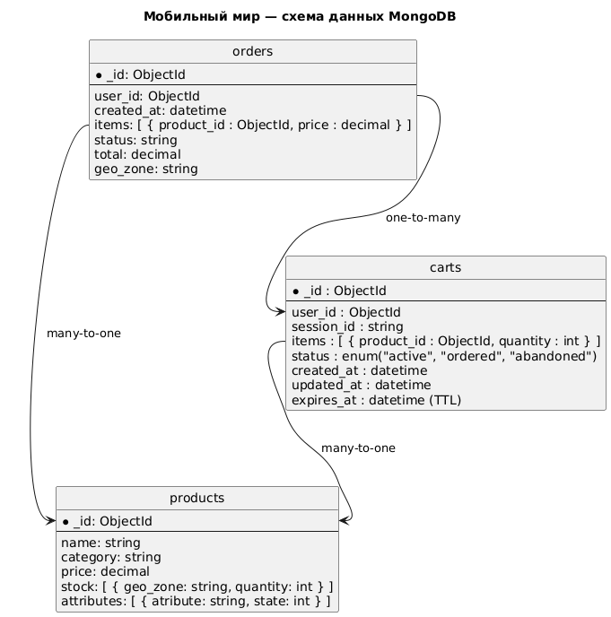

# Задание 7. Проектирование схем коллекций для шардирования данных

## Общая информация
В рамках проекта онлайн-магазина **«Мобильный мир»**, данные хранятся в трёх основных коллекциях MongoDB:

* `orders` — заказы клиентов;
* `products` —  сведения о товарах;
* `carts` — данные о текущих корзинах (как гостевых, так и пользовательских).

Требуется спроектировать схемы этих коллекций и выбрать подходящие шард-ключи с объяснением.

## Коллекция `orders`
### Структура
```json
{
  _id: ObjectId,
  user_id: ObjectId,
  created_at: datetime,
  items: [ { product_id: ObjectId, price: decimal } ],
  status: string,
  total: decimal,
  geo_zone: string
}
```

### Основные операции
* Частая вставка новых заказов
* Поиск заказов по пользователю (`user_id`)
* Отображение статуса заказа

### Рекомендуемая стратегия шардирования
`user_id` — обеспечивает равномерное распределение. Используется в большинстве запросов.

### Команды MongoDB

```js
sh.shardCollection("somedb.orders", { "user_id": "hashed" })
```

## Коллекция `products`
### Структура
```json
{
  _id: ObjectId,
  name: string,
  category: string,
  price: decimal,
  stock: [ { geo_zone: string, quantity: int } ],
  attributes: [ { atribute: string, state: int } ]
}
```

### Основные операции
* Частое обновление остатков
* Поиск по фильтрам: (`category`, `price`)
* Поиск товара по (`_id`) для отображения

### Рекомендуемая стратегия шардирования
* `_id` — равномерное распределение, стабильный ключ.

### Команды MongoDB
```js
sh.shardCollection("somedb.products", { "_id": "hashed" })
```

## Коллекция `carts`
### Структура
```json
{
  _id: ObjectId,
  user_id: ObjectId,
  session_id: string,
  items: [ { product_id: ObjectId, quantity: int } ],
  status: string,
  created_at: datetime,
  updated_at: datetime,
  expires_at: datetime (TTL)
}
```

### Основные операции
* Частая вставка новых корзин
* Поиск по (`user_id` + `status: active`) или (`session_id` + `status: active`);
* Обновление `items` и `status`.

### Рекомендуемая стратегия шардирования
* `user_id` — основной идентификатор. Используется в большинстве запросов.
* Для гостей стоит тоже заполнять поле user_id, например так: `user_id = hash(session_id)`.

### Команды MongoDB
```js
sh.shardCollection("somedb.carts", { "user_id": "hashed" })
```

## Диаграммы коллекций и шардирования
